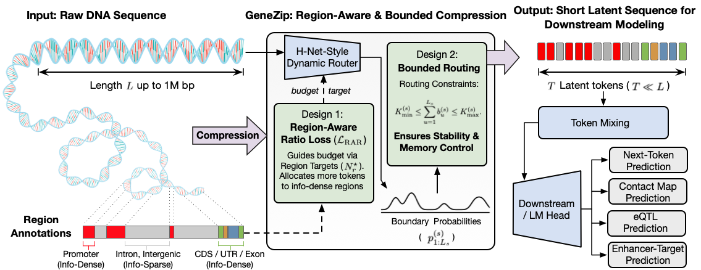

<div align="center">

# GeneZip: Region-Aware Compression for Long Context DNA Modeling

</div>

Public code release for [GeneZip](https://arxiv.org/abs/2602.17739).

## Abstract

Long-context DNA models are limited by token-mixing cost and by how compression allocates representational budget across the genome. Existing approaches operate close to base-pair resolution, apply fixed downsampling, or learn content-dependent chunks without an explicit genomic budget, making long-context pretraining expensive and difficult to control. We introduce GeneZip, a region-aware DNA compression framework that combines H-Net-style dynamic routing with a Region-Aware Ratio (RAR) objective and bounded routing. GeneZip uses static gene-structure annotations during compression training to specify region-wise base-pairs-per-token (BPT) targets; at inference time, it compresses raw unseen DNA without annotations. GeneZip provides three main benefits. First, it is effective: GeneZip variants achieve the best validation PPL among encoder-based compressors, with GeneZip-70M already operating at 137.6 BPT, and across four reproducible DNALongBench tasks---contact map prediction, eQTL prediction, enhancer-target gene prediction, and transcription-initiation signal prediction---GeneZip obtains the best average rank among compared sequence models. Second, it is redundancy-aware: a post-hoc RepeatMasker/TRF analysis shows that, without repeat supervision, GeneZip assigns higher local BPT to TE-derived interspersed repeats and tandem repeats, two major classes of repetitive DNA sequence redundancy. Third, it is efficient: by reducing the effective token-mixing length, GeneZip enables longer-context and larger-capacity pretraining, including 128K-context and 636M-parameter variants on a single A100 80GB GPU, and fine-tunes the eQTL task 50.4x faster than JanusDNA (50 vs. 2520 minutes). These results establish GeneZip as an effective, redundancy-aware, and efficient compression interface for long-context DNA modeling.

## Overview



## Environment (uv)

Recommended: Linux + NVIDIA GPU.

```bash
uv venv --python 3.12
uv sync
source .venv/bin/activate
```

Tested release environment:

| Component | Tested setting |
| --- | --- |
| OS | Linux x86_64 |
| GPU | NVIDIA A100 80GB |
| CUDA stack | CUDA 12.6-compatible driver/runtime |
| Python | 3.12 |
| PyTorch | 2.8.* with CUDA 12.6 wheels |
| Kernel packages | `flash-attn==2.8.3`, `mamba-ssm==2.3.0`, `causal-conv1d==1.6.0` |
| Package manager | `uv` with the checked-in `uv.lock` |

This release contains runnable GeneZip targets only. Non-GeneZip baselines in the paper are cited context rather than release targets. HNet is included only as the uniform-resolution ablation control.

## Released checkpoints

| Checkpoint | `mu_r` |
| --- | --- |
| `GeneZip-70M-Transcript-balanced` | `(1, 1, 2, 2, 8, 8, 16)` |
| `GeneZip-70M-Cis-regulatory-focused` | `(1, 16, 2, 4, 2, 2, 4)` |
| `GeneZip-70M-Promoter-distal-regulatory` | `(1, 16, 8, 8, 2, 2, 4)` |
| `GeneZip-70M-Intergenic-focused` | `(32, 16, 8, 4, 2, 4, 1)` |
| `GeneZip-70M-Transcript-balanced-128K` | `(1, 1, 2, 2, 8, 8, 16)` |
| `GeneZip-70M-Cis-regulatory-focused-128K` | `(1, 16, 2, 4, 2, 2, 4)` |
| `GeneZip-636M-Transcript-balanced` | `(1, 1, 2, 2, 8, 8, 16)` |
| `GeneZip-636M-Transcript-balanced-128K` | `(1, 1, 2, 2, 8, 8, 16)` |
| `HNet-70M-Uniform-resolution` | `(1, 1, 1, 1, 1, 1, 1)` |

`mu_r` is ordered as `(Promoter, CDS, UTR, Exon, Intron, Near-Intergenic,
Distal-Intergenic)`. Each entry is the region multiplier for the target
base-pairs-per-token budget in the RAR objective; larger values apply stronger
compression to that region, while smaller values preserve a denser token budget.

## Paper Result Mapping

| Paper result | Checkpoint | Script | Key overrides | Metric keys |
| --- | --- | --- | --- | --- |
| CMP aggregate | `GeneZip-70M-Transcript-balanced` | `shell/dnalongbench/cmp.sh` | run all five `SUBSET` values | `eval/scc`, `eval/corr` |
| eQTL aggregate | `GeneZip-70M-Cis-regulatory-focused` | `shell/dnalongbench/eqtl.sh` | run all nine `CELL_TYPE` values | `valid_auroc`, `valid_auprc`, `test_auroc`, `test_auprc` |
| ETGP | `GeneZip-70M-Intergenic-focused` | `shell/dnalongbench/etgp.sh` | default `CELL_TYPE=CRISPRi_EPI_K562_hg19` | `valid_auroc`, `valid_auprc`, `test_auroc`, `test_auprc` |
| TISP | `GeneZip-70M-Promoter-distal-regulatory` | `shell/dnalongbench/tisp.sh` | default task wrapper | task-specific validation/test metrics |

## Reproduce Stage1 Pre-Training

To reproduce the validation-selected 12.8K GeneZip RAR pretraining sweeps:

```bash
export HF_USER=<your-hf-name>
for MU_R_ALIAS in Transcript-balanced Cis-regulatory-focused Promoter-distal-regulatory Intergenic-focused; do
  MU_R_ALIAS="${MU_R_ALIAS}" bash shell/pretrain/GeneZip-70M-12.8K-template.sh
done
```

`REGION_INFO=promoter1_cds...` can be passed directly to override the selected
region ratio. For example, `MU_R_ALIAS=Cis-regulatory-focused` produces
`GeneZip-70M-Cis-regulatory-focused`.

To reproduce the length and size checkpoints in Table 1:

```bash
bash shell/pretrain/GeneZip-70M-12.8K-template.sh
bash shell/pretrain/GeneZip-70M-128K-template.sh
bash shell/pretrain/GeneZip-636M-12.8K-template.sh
bash shell/pretrain/GeneZip-636M-128K-template.sh
```

The 128K templates default to continuing from the same-size, same-`MU_R_ALIAS`
12.8K checkpoint.

The four pretraining templates default to `NUM_PROCESSES=8` and Slurm
`--gres=gpu:8`. Override `NUM_PROCESSES`, batch size, or Slurm headers for a
smaller local run; the released defaults match the validated pretraining setup.


## Reproduce DNALongBench Tasks

### 1) CMP

```bash
bash shell/dnalongbench/cmp.sh
```

Default checkpoint: `GeneZip-70M-Transcript-balanced`. The single wrapper default runs the
HFF subset; reproduce the aggregate CMP result by running all five subsets:

```bash
for SUBSET in HFF H1hESC GM12878 IMR90 HCT116; do
  SUBSET="${SUBSET}" bash shell/dnalongbench/cmp.sh
done
```

### 2) eQTL

```bash
bash shell/dnalongbench/eqtl.sh
```

Default checkpoint: `GeneZip-70M-Cis-regulatory-focused`. The single wrapper default runs
`Artery_Tibial`; reproduce the aggregate eQTL result by running all nine cell
types:

```bash
for CELL_TYPE in \
  Adipose_Subcutaneous Artery_Tibial Cells_Cultured_fibroblasts \
  Muscle_Skeletal Nerve_Tibial Skin_Not_Sun_Exposed_Suprapubic \
  Skin_Sun_Exposed_Lower_leg Thyroid Whole_Blood; do
  CELL_TYPE="${CELL_TYPE}" bash shell/dnalongbench/eqtl.sh
done
```

### 3) ETGP

```bash
bash shell/dnalongbench/etgp.sh
```

Default checkpoint: `GeneZip-70M-Intergenic-focused`.

### 4) TISP

```bash
bash shell/dnalongbench/tisp.sh
```

Default checkpoint: `GeneZip-70M-Promoter-distal-regulatory`. To reproduce the
128K GeneZip TISP setting reported in the paper, run
`CKPT=GeneZip-70M-Transcript-balanced-128K`.

Each wrapper accepts a checkpoint override:

```bash
CKPT=GeneZip-70M-Promoter-distal-regulatory bash shell/dnalongbench/tisp.sh
CKPT=GeneZip-70M-Transcript-balanced-128K bash shell/dnalongbench/tisp.sh
CKPT=GeneZip-70M-Cis-regulatory-focused bash shell/dnalongbench/eqtl.sh
CKPT=GeneZip-70M-Intergenic-focused bash shell/dnalongbench/etgp.sh
CKPT=GeneZip-70M-Transcript-balanced bash shell/dnalongbench/cmp.sh
```

To reproduce the full region-ratio ablation table, run each task over all public
GeneZip checkpoints and the uniform-resolution HNet control:

```bash
for CKPT in GeneZip-70M-Promoter-distal-regulatory GeneZip-70M-Cis-regulatory-focused GeneZip-70M-Intergenic-focused GeneZip-70M-Transcript-balanced HNet-70M-Uniform-resolution; do
  for CELL_TYPE in \
    Adipose_Subcutaneous Artery_Tibial Cells_Cultured_fibroblasts \
    Muscle_Skeletal Nerve_Tibial Skin_Not_Sun_Exposed_Suprapubic \
    Skin_Sun_Exposed_Lower_leg Thyroid Whole_Blood; do
    CKPT="${CKPT}" CELL_TYPE="${CELL_TYPE}" bash shell/dnalongbench/eqtl.sh
  done

  CKPT="${CKPT}" bash shell/dnalongbench/etgp.sh

  for SUBSET in HFF H1hESC GM12878 IMR90 HCT116; do
    CKPT="${CKPT}" SUBSET="${SUBSET}" bash shell/dnalongbench/cmp.sh
  done

  CKPT="${CKPT}" bash shell/dnalongbench/tisp.sh
done
```

## Citation

Please cite the GeneZip paper when using this release.

```bibtex
@article{zhao2026genezip,
  title = {GeneZip: Region-Aware Compression for Long Context DNA Modeling},
  author = {Jianan Zhao and Xixian Liu and Zhihao Zhan and Xinyu Yuan and Hongyu Guo and Jian Tang},
  journal = {arXiv preprint arXiv:2602.17739},
  year = {2026},
  url = {https://arxiv.org/abs/2602.17739}
}
```
